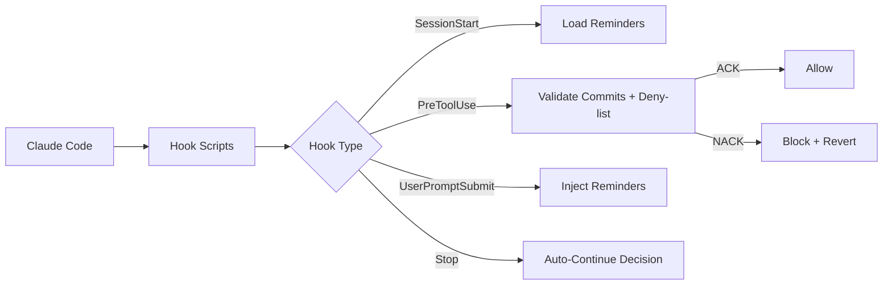

# Claude Auto

Husky-style hooks and skills management for Claude Code.

[](https://github.com/BeOnAuto/claude-auto/actions) [](https://www.npmjs.com/package/claude-auto) [](LICENSE) []()

---

## Purpose

Without Claude Auto, you babysit every AI coding session. You watch, nudge, correct, and context-switch constantly. One task at a time, full attention required.

Claude Auto installs a quality loop into Claude Code via hooks. Validators gate every commit. Reminders inject your guidelines into every prompt. Deny-lists protect files from modification. Auto-continue keeps the agent working until the plan is done. The system earns trust, and trust enables parallelization via git worktrees.

## Key Concepts

- **Hooks**: Four integration points (SessionStart, PreToolUse, UserPromptSubmit, Stop) that let Claude Auto observe and control Claude Code's behavior
- **Validators**: Markdown files with YAML frontmatter that ACK or NACK commits based on your criteria
- **Reminders**: Context-injection files that surface your guidelines at the right moment
- **Deny-list**: Glob patterns that protect files from modification
- **TCR Discipline**: Test && Commit || Revert. Bad code auto-reverts
- **Auto-Continue**: Keeps the agent going until the plan is done

---

## Installation

```bash
npx claude-auto install
```

## Quick Start

```bash
npx claude-auto install
npx claude-auto doctor
```

After installation, Claude Auto automatically:

- Injects hooks that validate every commit against your criteria
- Creates reminders that inject your guidelines into prompts
- Sets up file protection via deny-lists
- Merges settings with smart project/local overrides

**Next steps:**

- [Getting Started guide](./docs/getting-started.md)
- [The Ketchup Technique](./docs/ketchup-technique.md)

---

## How-to Guides

### Verify Installation Health

```bash
npx claude-auto doctor
```

### Fix Broken Symlinks

```bash
npx claude-auto repair
```

### List Active Reminders

```bash
npx claude-auto reminders
```

### Configure for CI/CD

```bash
npx claude-auto install --non-interactive
```

### Multiply with Git Worktrees

```bash
git worktree add ../feature-auth feature/auth
git worktree add ../feature-payments feature/payments

cd ../feature-auth && npx claude-auto install
cd ../feature-payments && npx claude-auto install
```

Each worktree runs its own Claude Auto instance, all quality-validated.

---

## CLI Reference

### Commands

#### `claude-auto install`

Install and configure Claude Auto in your project.

```bash
claude-auto install [target-path] [options]
```

| Option | Type | Default | Description |
| ------ | ---- | ------- | ----------- |
| `--local` | boolean | false | Use development mode (runs TypeScript source directly via tsx) |

#### `claude-auto doctor`

Verify every expected symlink is valid and report issues.

```bash
claude-auto doctor
```

#### `claude-auto status`

Show symlink status for hook scripts, validators, and reminders.

```bash
claude-auto status
```

#### `claude-auto repair`

Recreate broken or missing symlinks between the package and project directories.

```bash
claude-auto repair
```

#### `claude-auto reminders`

List active reminders with name, hook, and priority metadata.

```bash
claude-auto reminders
```

#### `claude-auto clean-logs`

Remove old log files from the logs directory.

```bash
claude-auto clean-logs [options]
```

| Option | Type | Default | Description |
| ------ | ---- | ------- | ----------- |
| `--older-than` | number | 60 | Keep logs newer than N minutes |

#### `claude-auto tui`

Launch the full-screen terminal UI with live log tailing.

```bash
claude-auto tui
```

### Configuration File

```json
{
  "autoContinue": { "mode": "smart" },
  "validateCommit": { "mode": "strict", "batchCount": 3 },
  "denyList": { "enabled": true },
  "promptReminder": { "enabled": true },
  "subagentHooks": {
    "validateCommitOnExplore": false,
    "validateCommitOnWork": true,
    "validateCommitOnUnknown": true
  }
}
```

Configuration lives in `.claude-auto/.claude.hooks.json`. See the [Configuration guide](./docs/configuration.md) for all options.

### Settings Layering

Settings merge in priority order:

1. `templates/settings.json` (package defaults)
2. `.claude/settings.project.json` (team overrides)
3. `.claude/settings.local.json` (personal overrides)

---

## How It Works



Hook scripts read JSON from stdin, delegate to handlers in `src/hooks/`, log results, and output JSON to stdout. Validators are batched (default 3 per Claude CLI call) for efficient parallel validation. Reminders are matched by hook type, mode, and tool name, then injected as `<system-reminder>` blocks.

---

## Troubleshooting

### Command Not Found

**Symptom:** `claude-auto: command not found`

**Cause:** Package not installed globally or not in PATH.

**Solution:**

```bash
npx claude-auto install
```

### Hooks Not Firing

**Symptom:** Commits go through without validation.

**Cause:** Settings not merged or symlinks broken.

**Solution:**

```bash
npx claude-auto doctor
npx claude-auto repair
```

### Enable Debug Logging

```bash
DEBUG=claude-auto npx claude-auto install
```

Debug logs write to `.claude-auto/logs/claude-auto/debug.log`.

---

## Documentation

| Guide | Description |
| ----- | ----------- |
| [Getting Started](./docs/getting-started.md) | First-time setup and core concepts |
| [Installation](./docs/installation.md) | Detailed installation guide |
| [The Ketchup Technique](./docs/ketchup-technique.md) | The planning methodology |
| [Configuration](./docs/configuration.md) | All configuration options |
| [Hooks Guide](./docs/hooks-guide.md) | Hook system deep-dive |
| [Reminders Guide](./docs/reminders-guide.md) | Context injection system |
| [Validators Guide](./docs/validators-guide.md) | Commit validation rules |
| [API Reference](./docs/api-reference.md) | Programmatic access |
| [Architecture](./docs/architecture.md) | System design internals |
| [Origin Story](./docs/origin-story.md) | How Claude Auto came to be |

---

## Architecture

```
src/
├── cli/                  # CLI commands (install, doctor, repair, status, reminders, tui)
│   └── tui/              # Full-screen terminal UI with live log tailing
├── hooks/                # Hook handlers (session-start, pre-tool-use, user-prompt-submit, auto-continue)
├── commit-validator.ts   # Batched commit validation with appeal support
├── config-loader.ts      # Cosmiconfig-based configuration
├── deny-list.ts          # File protection via micromatch patterns
├── reminder-loader.ts    # Markdown + YAML frontmatter reminder system
├── settings-merger.ts    # Three-layer settings merge with lock-file caching
├── hook-state.ts         # Hook state management (.claude.hooks.json)
├── validator-loader.ts   # Markdown validator loader
└── index.ts              # Public API barrel exports
scripts/
├── session-start.ts      # SessionStart hook entry-point
├── pre-tool-use.ts       # PreToolUse hook entry-point
├── user-prompt-submit.ts # UserPromptSubmit hook entry-point
└── auto-continue.ts      # Stop hook entry-point
```

### Dependencies

| Package | Usage |
| ------- | ----- |
| commander | CLI framework |
| cosmiconfig | Configuration file discovery |
| gray-matter | YAML frontmatter parsing for validators and reminders |
| micromatch | Glob pattern matching for deny-lists |

---

## Development

### Prerequisites

- Node.js 18+
- pnpm 10+

### Setup

```bash
git clone https://github.com/BeOnAuto/claude-auto.git
cd claude-auto
pnpm install
pnpm build
```

### Commands

| Command | Description |
| ------- | ----------- |
| `pnpm build` | TypeScript compile + esbuild bundle scripts |
| `pnpm test` | Run all tests (vitest) |
| `pnpm type-check` | TypeScript type checking |
| `pnpm lint` | Biome lint check |
| `pnpm check` | Full CI: build + type-check + test + lint |

---

## License

MIT &copy; 2025 BeOnAuto, Inc.

See [LICENSE](LICENSE) for details.
